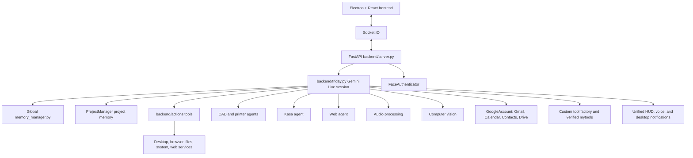

# F.R.I.D.A.Y

F.R.I.D.A.Y is a Windows-focused desktop AI assistant built with Electron, React, Python, FastAPI, Socket.IO, and Google's Gemini Live API. It supports real-time voice conversation, persistent memory, computer control, web automation, smart-home devices, CAD generation, 3D printing, live vision, and comprehensive file workflows.

## Features

### Core AI Capabilities
- **Gemini Live voice:** streaming input/output audio, transcription, interruption handling, reconnect context, and text input with live video streaming
- **Sounddevice audio:** low-latency microphone capture, speaker playback, device discovery, and PCM streaming without PyAudio
- **Live camera vision:** continuous webcam streaming to Gemini Live for real-time scene awareness, "what am I looking at?" queries, and hands-free visual interaction
- **Persistent memory:** project-scoped chat history remains in each project; global conversations are written to daily files under `long_term_memory/transcripts/`, indexed in `memory_index.jsonl`, and important facts are deduplicated in `facts.jsonl`
- **Important facts:** Friday extracts durable identity, preference, relationship, project, routine, goal, decision, and constraint facts. It rejects passwords, API keys, tokens, credentials, and guesses
- **Smart fact retrieval:** automatically searches memory before claiming ignorance about personal details, using exact subject matches, phrase matches, token coverage, recency, fact confidence, and current-project relevance

### Vision & Interaction
- **Face authentication:** MediaPipe-based face recognition for secure access control
- **Hand tracking:** real-time hand gesture recognition for cursor control and UI interaction
- **Screen capture:** mss-based screen sharing and desktop monitoring
- **Live video streaming:** continuous webcam frames sent to Gemini Live at ~1 fps for persistent visual awareness

### CAD & 3D Printing
- **CAD generation:** Gemini-assisted `build123d` CAD generation from natural language descriptions
- **CAD iteration:** modify and iterate on existing 3D designs with user feedback
- **3D prototype visualization:** wireframe prototype generation and interactive 3D viewing
- **STL preview:** preview 3D models in the integrated viewer before printing
- **Printer discovery:** automatic discovery of 3D printers on local network (OctoPrint/Moonraker)
- **Slicer integration:** direct integration with OrcaSlicer/PrusaSlicer profiles
- **Print management:** print submission, status monitoring, progress tracking, and temperature monitoring
- **Print queue:** monitor multiple printers simultaneously with real-time status updates

### Smart Home & IoT
- **Kasa integration:** TP-Link Kasa device discovery and control
- **Light control:** turn on/off, brightness adjustment, color control for smart bulbs
- **Plug control:** control smart plugs and power strips
- **Device management:** discover, list, and manage multiple smart home devices
- **Scene control:** control multiple devices together for lighting scenes

### Desktop Automation
- **Mouse/keyboard control:** type text, click, drag, scroll, hotkeys, clipboard operations
- **Screen interaction:** screenshot capture, screen element detection, focus windows
- **System settings:** volume, brightness, window management (minimize/maximize/snap), dark mode
- **File management:** create, delete, move, copy, rename, search, organize files and folders
- **Application control:** launch desktop applications, window management, process management
- **System monitoring:** CPU, RAM, GPU usage, temperature monitoring, uptime tracking
- **Desktop organization:** automatic desktop file organization by type/date
- **Wallpaper control:** set wallpaper from local images or URLs, desktop stats

### Web & Communication
- **Web automation:** Playwright-based browser control with real browser profiles
- **Web search:** Gemini-grounded search with multiple modes (search, news, research, price, compare)
- **Browser control:** navigate, fill forms, click elements, extract text, manage tabs
- **Multi-platform messaging:** WhatsApp, Telegram, Discord, Signal, Instagram, Messenger integration
- **Contact management:** persistent contact storage with multiple platforms per contact
- **YouTube integration:** video playback, transcript summarization, trending videos, video info
- **Flight search:** Google Flights integration for flight booking and comparison
- **Google account integration:** OAuth connection for Gmail, Google Calendar, Google Contacts, and Google Drive
- **Gmail tools:** unread/search queries, full thread reading, and draft creation
- **Calendar tools:** list/search events, create/update/delete events, and recurring events in Johannesburg time
- **Google Contacts tools:** paginated reads, local import, and bidirectional synchronization
- **Google Drive tools:** list recent non-deleted Drive files
- **Google sync:** refresh unread mail, upcoming events, contacts, and recent Drive files into a local cache

### Development & Productivity
- **Code assistance:** AI-powered code generation, editing, explanation, optimization, and debugging
- **Project building:** complete project scaffolding from natural language descriptions
- **Git workflow:** git status, branch management, diff review, commit assistance, regression checking
- **PowerShell execution:** run explicitly requested PowerShell commands with timeout control
- **Agent deployment:** background agents for long-running tasks (repo repair, etc.)
- **Self-maintenance:** run tests, check for errors, build frontend, install dependencies, and track recurring tool failures
- **Self-build:** compile, test, build, attempt dependency recovery, and report verified results
- **Custom tool factory:** create, validate, smoke-test, register, execute, and track custom tools
- **Game management:** Steam/Epic game installation, updates, download status monitoring

### File Processing
- **Universal file support:** images, PDFs, documents, spreadsheets, JSON, code, audio, video, archives, presentations
- **AI-powered analysis:** describe, OCR, summarize, explain, review, and transform files
- **Upload management:** temporary file storage with automatic cleanup, permanent save option
- **Wallpaper workflow:** upload images → process → set as desktop wallpaper
- **File search:** advanced file search across the system with filters
- **Disk usage:** analyze storage usage and find large files

### System Management
- **Proactive monitoring:** CPU, RAM, temperature, GPU alerts with configurable cooldowns
- **Alert management:** mute/unmute specific alert categories, enable/disable system alerts
- **Topic monitoring:** daily news updates for custom topics (crypto/financial blocked)
- **Scheduled reminders:** OS-level reminder notifications for specific dates/times
- **Weather integration:** weather search and reporting for any city/time period
- **Live weather:** current conditions, temperature, humidity, wind, daily high/low, and rain probability
- **Routine automation:** predefined workflows (morning briefing, focus mode, work summary, dev assistant)
- **Undo system:** reverse recent actions including file operations, wallpaper changes, project switches

### User Interface
- **Modular action windows:** draggable, stackable React windows for each major feature
- **Live transcription:** real-time speech-to-text transcription display
- **Attached result cards:** weather, Google service results, and tool execution status appear as HUD tabs above chat
- **Visual feedback:** audio visualizer, CAD progress, web agent logs, system alerts
- **Customizable settings:** comprehensive settings window for all features
- **Gesture control:** hand-based cursor movement and UI interaction
- **Theme system:** dark mode with customizable accent colors
- **Responsive design:** adaptive layout for different screen sizes

## Architecture



The frontend connects to `http://localhost:8000` through Socket.IO. Electron starts the Python backend and loads the Vite renderer. The Electron launcher prefers the `FRIDAY_PYTHON` environment variable, then the active Conda environment, `%USERPROFILE%\.conda\envs\friday\python.exe`, and finally `python`.

## Security & Reliability

### Security Features
- **Electron hardening:** `nodeIntegration: false`, `contextIsolation: true`, secure preload scripts
- **CORS restrictions:** limited to trusted origins (localhost, Capacitor/Electron)
- **Path validation:** project file writes are intended to stay inside the active project; review file-management requests carefully
- **Subprocess timeouts:** all subprocess calls have timeouts to prevent hanging
- **Crash recovery:** audio loop crash guard with user notification
- **Confirmation system:** user approval for destructive or external operations
- **Tool isolation:** generated Python tools execute in timed subprocesses and only approved templates are available
- **OAuth secret protection:** Google client secrets and refresh tokens are local-only and Git-ignored

### Reliability Features
- **Automatic reconnection:** Gemini Live session reconnection with context restoration
- **Confirmation cleanup:** proper cleanup of pending confirmations on all error paths
- **Resource cleanup:** proper cleanup of resources on shutdown
- **Error handling:** comprehensive error handling across all components
- **Logging framework:** structured debug logging for troubleshooting

## Requirements

- **Windows 10/11** is the primary supported platform (Linux/macOS support exists in some modules)
- **Python 3.11+** through the existing Miniconda/Anaconda environment named `friday`
- **Node.js 18+** and npm
- **Git**
- **Gemini API key** from [Google AI Studio](https://aistudio.google.com/app/apikey)
- **Webcam** for face authentication, camera mode, or hand tracking
- **Optional:** OrcaSlicer/PrusaSlicer, Kasa devices, OctoPrint/Moonraker printer, Playwright browsers

## Installation

```powershell
git clone https://github.com/mazwisprojects/Friday-AI-Assistant.git
cd Friday-AI-Assistant

conda activate friday
pip install -r requirements.txt
npm install
```

Create `.env` in the repository root. Never commit it:

```text
GEMINI_API_KEY=your_api_key_here
```

### Google Account Setup

Google integration uses OAuth. Friday does not store your Google password. Create a Desktop OAuth client in the [Google Cloud Console](https://console.cloud.google.com/apis/credentials), enable the Gmail API, Google Calendar API, People API, and Google Drive API, then download the client JSON as:

```text
backend/google_client_secret.json
```

For a private app in Testing mode, add your Google address under **Google Auth Platform → Audience → Test users**. In Friday, open **Settings → Google Account → Connect** and approve the requested scopes. The refresh token is stored locally in `backend/google_token.json`, which is ignored by Git.

The current OAuth scopes provide Gmail read/drafts, Calendar read/create/update/delete, Contacts read/write, and Drive read access. Enable the Gmail API, Google Calendar API, People API, and Google Drive API in the same project. Reconnect Google after changing scopes.

Install the Playwright browser binaries used by browser automation and flight search:

```powershell
playwright install chromium firefox
```

WebKit is intentionally not installed. Safari is not supported on Windows and Playwright's WebKit host validation may require native libraries that are not present by default.

For face authentication, place a clear reference image at `backend/reference.jpg`, then enable `face_auth_enabled` in the generated settings file or through the Settings window.

## Run

Activate the correct environment before running the application:

```powershell
conda activate friday
npm run dev
```

`npm run dev` starts Vite and Electron together. The Electron process starts `backend/server.py` and waits for the backend health endpoint at `http://127.0.0.1:8000/status`.

Useful scripts:

```powershell
npm run build                 # Build the React renderer
python backend/server.py      # Run only the backend
npm run start                 # Start Electron against the built renderer
```

If Node is not available after Conda activation, use the full npm path on Windows:

```powershell
& "C:\Program Files\nodejs\npm.cmd" run dev
```

## Tools and Permissions

Friday's comprehensive tool set includes 40+ tools organized into categories:

### CAD & 3D Printing
- `generate_cad` - Generate 3D CAD models from descriptions
- `iterate_cad` - Modify existing CAD designs
- `generate_cad_prototype` - Create wireframe prototypes
- `discover_printers` - Find 3D printers on network
- `print_stl` - Print STL files to 3D printers
- `get_print_status` - Monitor print progress and status

### Project & Memory
- `create_project` - Create new project folders
- `switch_project` - Switch between project contexts
- `list_projects` - List all available projects
- `search_memory` - Search complete conversation history
- `write_file` - Write content to project files
- `read_file` - Read project file contents
- `read_directory` - List directory contents

### Computer Control
- `computer_control` - Mouse, keyboard, clipboard automation
- `computer_settings` - System settings (volume, brightness, windows)
- `desktop_control` - Wallpaper, desktop organization
- `manage_files` - File system operations across entire computer
- `open_application` - Launch desktop applications

### Web & Communication
- `run_web_agent` - Automated web browsing tasks
- `web_search` - Web search with multiple modes
- `browser_control` - Fine-grained browser control
- `send_message` - Multi-platform messaging
- `youtube_video` - YouTube video integration
- `contacts_manager` - Contact management
- `find_flights` - Flight search and booking

### Google Services
- `gmail_read` - Read Gmail messages using Gmail search syntax
- `gmail_thread_read` - Read all messages in a Gmail thread
- `gmail_create_draft` - Create a Gmail draft after confirmation
- `google_calendar_create` - Create a Google Calendar event
- `google_calendar_list` - Search upcoming Calendar events
- `google_calendar_update` - Update an event after confirmation
- `google_calendar_delete` - Delete an event after confirmation
- `google_calendar_recurring` - Create a recurring event after confirmation
- `google_contacts_read` - Read paginated Google Contacts
- `google_contacts_import` - Import Google Contacts into Friday's local store
- `google_contacts_sync` - Synchronize contacts in either direction after confirmation
- `google_drive_list` - List recent Google Drive files
- `sync_google_services` - Refresh Gmail, Calendar, Contacts, and Drive into a local cache

### Development
- `code_helper` - Code generation, editing, debugging
- `build_project` - Complete project scaffolding
- `git_workflow` - Git operations and review
- `run_powershell_command` - Shell command execution
- `self_maintenance` - System health checks
- `deploy_agent` - Background task agents

### System & Monitoring
- `get_system_status` - System metrics and health
- `manage_monitors` - Topic monitoring
- `mute_alert_category` - Alert configuration
- `undo_last_action` - Revert recent actions
- `cancel_current_task` - Stop running operations
- `set_reminder` - Schedule reminders
- `get_weather` - Weather information

### File Processing
- `process_file` - Universal file analysis and transformation
- `manage_uploads` - Upload and file management

### Smart Home
- `list_smart_devices` - Discover smart home devices
- `control_light` - Control smart lights and plugs

### Automation
- `run_routine` - Predefined workflow automation

Tool permissions are stored in `settings.json` and can be viewed in the Settings window. Normal tool calls run automatically. Google Calendar updates/deletes, recurring events, Google Contacts writes, and Gmail draft creation use Friday's explicit confirmation flow before changing external data. Generated Python tools are stored in `backend/mytools/` and run in a timed subprocess.

### Custom Tools

Friday can create and register new tools with the `build_custom_tool`, `test_custom_tool`, and `run_custom_tool` tools. Verified tools are written as Python modules under:

```text
backend/mytools/<tool_name>.py
```

Supported templates are `http_json_get`, `readonly_powershell`, and `python_module`. Python tools have no application-level 2,000-line limit: large modules are written directly to disk, compile-verified, smoke-tested, and reported with their source line count before registration. Registry files store metadata rather than duplicating the full source, so very large modules remain manageable. Each tool must pass manifest validation and a smoke test before it is registered with Gemini. Generated tool manifests are also recorded in the local-only `backend/custom_tools.json` registry.

### Custom Agents

Friday can build background agents with `build_agent` and verify them with `test_agent`. Verified agents are written to `backend/agents/<agent_name>.py`, where they must expose `run(goal, repo_path, log, cancel_event)`. They are registered with the background dispatcher and deployed with `deploy_agent` using the returned `agent_type`. Agent manifests are stored in the local-only `backend/custom_agents.json` registry. Friday does not modify `friday.py` or add a new dispatcher branch for each generated agent.

Generated agents are managed as plugins. `manage_plugins` can list plugin versions and enabled state, report agent health and recorded tool failures, create snapshots, list snapshots, roll back a snapshot, or enable/disable a generated tool or agent. Disabling a plugin removes it from future tool declarations or agent deployments without deleting its source module.

### Self-Build and Self-Upgrade

Use `self_build` to compile the backend, run tests, build the frontend, and attempt bounded dependency recovery when checks fail. Use `self_heal` for dependency/build recovery and `self_upgrade` to audit outdated packages, update declared Python and Node dependencies, scan for deprecation markers, rebuild the capability registry, and track recurring tool failures. Source code and prompts are not silently rewritten.

System alerts are controlled by `system_alerts_enabled`, `muted_alert_categories`, and `alert_cooldowns` in `settings.json`. Friday uses separate cooldowns for CPU, RAM, temperature, and GPU alerts. An alert category remains quiet while the problem stays continuously above its threshold; it becomes eligible again only after the metric recovers meaningfully and later crosses the threshold again. You can also say `mute CPU alerts`, `unmute CPU alerts`, `disable system alerts`, or `enable system alerts`. These choices persist across restarts.

## Memory Architecture

### Project Memory
Project memory is kept by `ProjectManager` in `projects/<project>/chat_history.jsonl`. The temporary project is recreated on startup, so it is not permanent.

### Global Memory
Global memory is independent of projects:

```text
long_term_memory/
├── transcripts/              # One human-readable UTF-8 transcript per day
├── memory_index.jsonl        # All logged messages across projects and restarts
├── facts.jsonl               # Deduplicated durable facts
├── uploads/                  # Temporary and explicitly saved uploads
└── backups/                  # Periodic memory snapshots
```

Recent global memory and active durable facts load when a Gemini session starts. The `search_memory` tool searches the complete stored lifetime and ranks results using exact subject matches, phrase matches, token coverage, recency, fact confidence, and current-project relevance. Fact corrections keep superseded records for history while only the newest active value is used. Semantic embedding search is an optional future upgrade; the current implementation does not require a vector database. Memory writes use a cross-process lock, fsync, recoverable JSONL reads, atomic upload replacement, and periodic snapshots. Storage is persistent but not cloud-backed or cryptographically immutable; protect and back up `long_term_memory/` if it matters.

### Memory Features
- **Fact extraction:** automatic extraction of important facts from conversations
- **Fact deduplication:** prevents redundant facts from cluttering memory
- **Time-based importance:** weights recent interactions higher
- **Context-aware search:** considers current project when ranking results
- **Memory compaction:** automatically summarizes older conversations to save space
- **Upload management:** separate temporary and permanent file storage with automatic cleanup

## Upload and Wallpaper Workflow

1. Open the File Manager action window
2. Select a picture
3. Choose an image action such as `Describe`, `OCR`, or `Analyze`, then select **Process file**
4. The file is placed in temporary upload storage and the result appears in the window
5. Say or type: `Set the uploaded image as my wallpaper.`
6. Confirm Friday's `desktop_control` request

Uploads are limited to 25 MB per file and 1 GB total by default. Temporary uploads are retained for 30 days, then removed by cleanup; use `manage_uploads` with `save` to keep one permanently, or `forget` to delete uploads. `list` shows retained upload metadata. File content is sent to Gemini only when the selected workflow requires it; metadata records the local path, type, size, and retention class.

## Configuration

### Settings File
The `settings.json` file controls:
- **Face authentication:** enable/disable and configure face recognition
- **Tool permissions:** confirmation requirements for each tool
- **System alerts:** enable/disable and configure alert thresholds and cooldowns
- **Alert categories:** mute/unmute specific alert types (CPU, RAM, temperature, GPU)
- **Upload limits:** file size and total storage limits
- **Upload retention:** automatic cleanup duration
- **Printer devices:** saved printer configurations
- **Kasa devices:** known smart home devices
- **Camera settings:** flip camera, gesture sensitivity
- **Audio devices:** input/output device selection

### Environment Variables
- `GEMINI_API_KEY`: Required for Gemini API access
- `FRIDAY_PYTHON`: Optional Python interpreter path
- `FRIDAY_MODEL`: Optional custom Gemini model
- `FRIDAY_FACT_MODEL`: Optional model for fact extraction

## Testing

```powershell
conda activate friday
pytest
```

The Python tests cover authentication, CAD, Kasa, printer, web-agent, and tool behavior. Frontend validation is currently a production build:

```powershell
& "C:\Program Files\nodejs\node.exe" "node_modules\vite\bin\vite.js" build
```

## Project Structure

```text
F.R.I.D.A.Y/
├── backend/
│   ├── friday.py              # Gemini Live session and tool dispatch
│   ├── server.py              # FastAPI and Socket.IO server
│   ├── config.py               # Centralized configuration utilities
│   ├── tools.py               # Gemini function declarations
│   ├── google_account.py       # Google OAuth and Gmail/Calendar/Contacts/Drive APIs
│   ├── tool_builder.py         # Verified custom-tool creation and execution
│   ├── notification_manager.py # Unified notification delivery and cooldowns
│   ├── mytools/                # Generated and example custom tool modules
│   ├── memory_manager.py      # Global transcripts, facts, and search
│   ├── project_manager.py     # Project-scoped memory and artifacts
│   ├── undo_manager.py         # Undo system for actions
│   ├── contacts_manager.py    # Contact management
│   ├── actions/               # Desktop, browser, web, file, media, and system tools
│   │   ├── computer_control.py
│   │   ├── computer_settings.py
│   │   ├── file_controller.py
│   │   ├── code_helper.py
│   │   ├── dev_agent.py
│   │   ├── web_search.py
│   │   ├── youtube_video.py
│   │   ├── desktop.py
│   │   ├── self_maintenance.py
│   │   ├── powershell_command.py
│   │   ├── git_workflow.py
│   │   └── ... (20+ action modules)
│   ├── cad_agent.py            # CAD generation and iteration
│   ├── printer_agent.py        # Printer discovery, slicing, and printing
│   ├── web_agent.py            # Browser task agent
│   ├── kasa_agent.py           # TP-Link Kasa integration
│   ├── authenticator.py        # Face authentication
│   └── proactive.py             # Proactive monitoring engine
├── electron/
│   ├── main.js                 # Electron window and Python launcher
│   └── preload.js              # Secure IPC bridge
├── src/
│   ├── App.jsx                 # Main React application
│   ├── components/             # Core UI and action windows
│   │   ├── ChatModule.jsx
│   │   ├── ToolsModule.jsx
│   │   ├── Visualizer.jsx
│   │   ├── TopAudioBar.jsx
│   │   ├── CadWindow.jsx
│   │   ├── BrowserWindow.jsx
│   │   ├── File ManagerWindow.jsx
│   │   ├── SettingsWindow.jsx
│   │   └── ... (25+ components)
│   └── electron.d.ts            # TypeScript definitions
├── public/                     # MediaPipe model assets
├── tests/                      # Python test suite
├── requirements.txt            # Python dependencies
├── package.json                # Node/Electron dependencies and scripts
└── README.md                   # This file
```

## Known Limitations

- **Gemini API requirements:** Requires internet connectivity and available API quota
- **Single camera/audio flow:** The primary live session uses one camera/audio flow; `screen_processor.py` remains separate to avoid competing Gemini Live connections
- **Platform support:** Linux and macOS support exists in several action modules but is not the primary tested environment
- **Optional dependencies:** Some actions require additional software (pycaw, win10toast, send2trash, Steam, local printers)
- **Alert tuning:** System alerts use cooldowns, but proactive behavior should be tuned if it becomes too frequent
- **Bundle size:** Large frontend bundles and outdated Browserslist data may produce non-blocking Vite warnings
- **Memory persistence:** Storage is local and not cloud-backed; manual backups recommended for important data

## Security Considerations

- **File access:** File-management and code tools can access sensitive local data; use them only with trusted requests
- **Code execution:** `python_module` custom tools execute generated Python in a timed subprocess; only create them intentionally
- **Web automation:** Browser control operates with user's own profiles and can access web accounts
- **API keys:** Gemini API key is stored in environment variables - protect this file
- **Network access:** Friday can make web requests, call approved Google APIs, and control browsers; keep the backend bound to localhost

## Troubleshooting

- **Google says access is blocked:** keep the OAuth app in Testing mode and add the exact Google account under Auth Platform → Audience → Test users.
- **Google is connected but a service fails:** reconnect after changing scopes and confirm the required API is enabled.
- **Friday starts without voice:** activate the existing `friday` Conda environment and confirm `sounddevice` can enumerate an input and output device.
- **Backend cannot start:** verify `GEMINI_API_KEY` is present and port `8000` is available.
- **Frontend cannot build:** run `npm install`, then `npm.cmd run build` from the repository root.
- **Playwright actions fail:** run `playwright install chromium firefox` in the existing `friday` environment.

## Recent Improvements

### Security Enhancements
- **Electron hardening:** Enabled context isolation and disabled node integration
- **CORS restrictions:** Limited Socket.IO to trusted origins only
- **Subprocess timeouts:** Added timeouts to all subprocess calls to prevent hanging
- **Crash recovery:** Added crash guard to audio loop with user notification
- **Confirmation cleanup:** Proper cleanup of pending confirmations on all error paths

### Reliability Improvements
- **Centralized configuration:** Consolidated config loading across all action modules
- **Live video streaming:** Enabled continuous webcam streaming by default
- **Enhanced error handling:** Improved error reporting and recovery mechanisms
- **Resource cleanup:** Better cleanup of resources on shutdown

### Feature Additions
- **Deploy agent system:** Background agents for long-running tasks
- **Git workflow integration:** Comprehensive git operations support
- **PowerShell execution:** Arbitrary command execution with timeout control
- **Enhanced file processing:** Support for more file types and operations
- **Routine automation:** Predefined workflow templates

## Future Roadmap

### High Priority
- Vector-based semantic search for memory
- Multi-user profile system
- Enhanced computer vision (object tracking, OCR, QR codes)
- Plugin system architecture

### Medium Priority
- Cloud backup and sync for memory
- Multi-platform messaging expansion
- File versioning system
- Advanced scheduling capabilities

### Low Priority
- Visual analytics dashboard
- Voice profile recognition
- Custom theme editor
- Mobile web interface

## License

This project is licensed under the MIT License. Copyright 2025 Sinegugu Mazwi.
