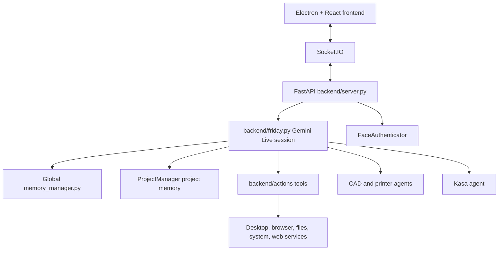

# F.R.I.D.A.Y

F.R.I.D.A.Y is a Windows-focused desktop AI assistant built with Electron, React, Python, FastAPI, Socket.IO, and Google's Gemini Live API. It supports real-time voice conversation, persistent memory, computer control, web automation, smart-home devices, CAD generation, 3D printing, vision, and file workflows.

## Features

- **Gemini Live voice:** streaming input/output audio, transcription, interruption handling, reconnect context, and text input.
- **Persistent memory:** project-scoped chat history remains in each project; global conversations are written to daily files under `long_term_memory/transcripts/`, indexed in `memory_index.jsonl`, and important facts are deduplicated in `facts.jsonl`.
- **Important facts:** Friday extracts durable identity, preference, relationship, project, routine, goal, decision, and constraint facts. It rejects passwords, API keys, tokens, credentials, and guesses.
- **Vision:** MediaPipe face authentication, hand tracking, camera frames, and screen capture through `mss`.
- **CAD and printing:** Gemini-assisted `build123d` CAD generation, iteration, STL preview, slicer integration, printer discovery, status, and print submission.
- **Smart home:** TP-Link Kasa discovery and light control.
- **Desktop actions:** mouse/keyboard/clipboard control, system settings, file management, application launching, system metrics, wallpaper control, reminders, web search, messaging, YouTube, and flight search.
- **Action windows:** React windows for code, computer control, desktop, files, flights, games, messages, processes, reminders, search, system monitoring, weather, and YouTube. They are draggable, bounded to the app viewport, scrollable where needed, and layered above the core interface.
- **File processing:** upload a file from the File Manager and process images, PDFs, documents, spreadsheets, JSON, code, audio, video, archives, and presentations. Images are preserved under `long_term_memory/uploads/` so you can ask Friday to set the uploaded picture as wallpaper.
- **Proactive monitoring:** system resource alerts and optional daily topic monitoring with cooldowns. Crypto and financial topics are blocked from background topic monitoring.

## Architecture



The frontend connects to `http://localhost:8000` through Socket.IO. Electron starts the Python backend and loads the Vite renderer. The Electron launcher prefers the `FRIDAY_PYTHON` environment variable, the active Conda environment, or `%USERPROFILE%\.conda\envs\friday\python.exe`, then falls back to `python`.

## Requirements

- Windows 10/11 is the primary supported platform.
- Python 3.11 through Miniconda or Anaconda.
- Node.js 18 or later and npm.
- Git.
- A Gemini API key from [Google AI Studio](https://aistudio.google.com/app/apikey).
- A webcam for face authentication, camera mode, or hand tracking.
- Optional: OrcaSlicer/PrusaSlicer, Kasa devices, OctoPrint/Moonraker printer, and installed desktop applications.

## Installation

```powershell
git clone https://github.com/mazwisprojects/Friday-AI-Assistant.git
cd Friday-AI-Assistant

conda create -n friday python=3.11 -y
conda activate friday
pip install -r requirements.txt
npm install
```

Create `.env` in the repository root. Never commit it:

```text
GEMINI_API_KEY=your_api_key_here
```

Install the Playwright browser binaries used by browser automation and flight search:

```powershell
playwright install chromium firefox
```

WebKit is intentionally not installed. Safari is not supported on Windows and Playwright's WebKit host validation may require native libraries that are not present by default.

For face authentication, place a clear reference image at `backend/reference.jpg`, then enable `face_auth_enabled` in the generated settings file or through the Settings window.

## Run

Activate the correct environment before running the application:

```powershell
conda activate friday
npm run dev
```

`npm run dev` starts Vite and Electron together. The Electron process starts `backend/server.py` and waits for the backend health endpoint at `http://127.0.0.1:8000/status`.

Useful scripts:

```powershell
npm run build                 # Build the React renderer
python backend/server.py      # Run only the backend
npm run start                 # Start Electron against the built renderer
```

If Node is not available after Conda activation, use the full npm path on Windows:

```powershell
& "C:\Program Files\nodejs\npm.cmd" run dev
```

## Tools and permissions

Friday's Gemini tool set includes CAD, web agent, project management, memory search, Kasa, printer control, computer control, computer settings, file management, app launching, system status, weather, reminders, desktop control, web search, messaging, YouTube, browser control, code helper, project building, flight search, game updates, file processing, and topic monitoring.

Tool permissions are stored in `settings.json` and can be changed in the Settings window. `true` means Friday asks for confirmation before executing the tool; `false` allows it automatically. Destructive or externally visible actions should remain protected. Code generation/build tools can write files, install dependencies, and execute code, so they should remain confirmation-protected.

System alerts are controlled by `system_alerts_enabled`, `muted_alert_categories`, and `alert_cooldowns` in `settings.json`. Friday uses separate cooldowns for CPU, RAM, temperature, and GPU alerts. An alert category remains quiet while the problem stays continuously above its threshold; it becomes eligible again only after the metric recovers meaningfully and later crosses the threshold again. You can also say `mute CPU alerts`, `unmute CPU alerts`, `disable system alerts`, or `enable system alerts`. These choices persist across restarts.

## Memory

Project memory is kept by `ProjectManager` in `projects/<project>/chat_history.jsonl`. The temporary project is recreated on startup, so it is not permanent.

Global memory is independent of projects:

```text
long_term_memory/
├── transcripts/              # One human-readable UTF-8 transcript per day
├── memory_index.jsonl        # All logged messages across projects and restarts
├── facts.jsonl               # Deduplicated durable facts
└── uploads/                  # Preserved uploaded images, such as wallpapers
```

Recent global memory and durable facts load when a Gemini session starts. The `search_memory` tool searches the complete stored lifetime by keywords. Storage is append-oriented, but the repository does not provide cloud backup or cryptographic immutability; protect and back up `long_term_memory/` if it matters.

## Upload and wallpaper workflow

1. Open the File Manager action window.
2. Select a picture.
3. Choose an image action such as `Describe`, `OCR`, or `Analyze`, then select **Process file**.
4. The image is retained in `long_term_memory/uploads/` and the result appears in the window.
5. Say or type: `Set the uploaded image as my wallpaper.`
6. Confirm Friday's `desktop_control` request.

Non-image uploads are saved temporarily for processing and removed afterward. The upload endpoint limits files to 25 MB and sanitizes the filename.

## Testing

```powershell
conda activate friday
pytest
```

The Python tests cover authentication, CAD, Kasa, printer, web-agent, and tool behavior. Frontend validation is currently a production build:

```powershell
& "C:\Program Files\nodejs\node.exe" "node_modules\vite\bin\vite.js" build
```

## Project structure

```text
F.R.I.D.A.Y/
├── backend/
│   ├── friday.py              # Gemini Live session and tool dispatch
│   ├── server.py              # FastAPI and Socket.IO server
│   ├── tools.py               # Gemini function declarations
│   ├── memory_manager.py      # Global transcripts, facts, and search
│   ├── project_manager.py     # Project-scoped memory and artifacts
│   ├── actions/               # Desktop, browser, web, file, media, and system tools
│   ├── cad_agent.py            # CAD generation and iteration
│   ├── printer_agent.py        # Printer discovery, slicing, and printing
│   ├── web_agent.py            # Browser task agent
│   ├── kasa_agent.py           # TP-Link Kasa integration
│   └── authenticator.py        # Face authentication
├── electron/main.js            # Electron window and Python launcher
├── src/App.jsx                 # Main React application
├── src/components/             # Core UI and action windows
├── public/                     # MediaPipe model assets
├── requirements.txt            # Python dependencies
├── package.json                # Node/Electron dependencies and scripts
└── README.md                   # This file
```

## Known limitations

- Gemini access requires internet connectivity and available API quota.
- The primary live session uses one camera/audio flow; `screen_processor.py` remains separate and is not wired into the main session to avoid competing Gemini Live connections.
- Linux and macOS support exists in several action modules but is not the primary tested environment.
- Some optional actions require additional installed software or services, such as `pycaw`, `win10toast`, `send2trash`, a browser profile, Steam, or a local printer.
- System alerts use cooldowns, but proactive behavior should be tuned if it becomes too frequent.
- Large frontend bundles and outdated Browserslist data may produce non-blocking Vite warnings.

## License

This project is licensed under the MIT License. Copyright 2025 Sinegugu Mazwi.
